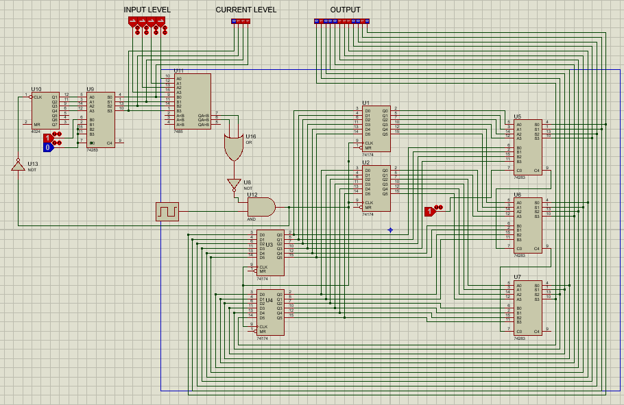

# Fibonacci-sequence generator
This repository contains a digital circuit to generate Fibonacci sequence.
The circuit uses D-filp flop as storage element for the numbers. Say the sequence is denoted by f1, f2, f3, f4…. .
The U1 stores the LSB of fi and U2 stores the MSB of fi while U3 and U4 stores the LSB and MSB respectively of fi+1 .
In each clock pulse the values are added by an adder and then stored in U3 and U4, simultaneously the previous value of U3 and U4 is transferred to U1 and U2.
A counter counts the number of clock cycle passed and compares with the given input. When the number of clock 
Pulse reaches to the given input, clock is interrupted and the circuit shows the Fibonacci number in binary format.
In this circuit first Fibonacci number is set to 5.

